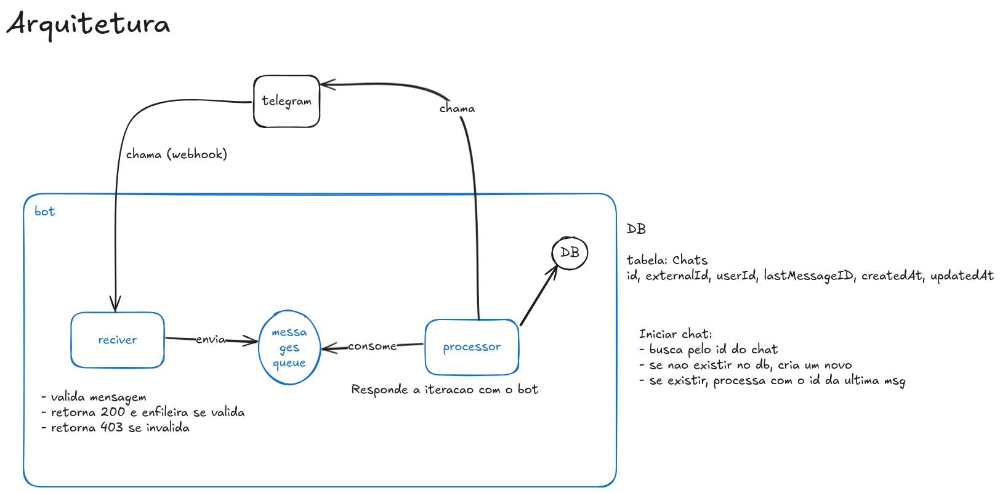

# Security Bot
Um chatbot simples para assuntos de cyber sec

## Visao de arquitetura:

# Funcionalidades
- QUIZ: Testar conhecimentos atraves de perginas aleatorias
- DUVIDAS: Lista de duvidas frequesntes sobre cyber sec
- GOLPES CONHECIDOS: Uma lista de alguns goles conhecidos e uma breve descricao
- DICAS UTEIS: Algumas dicas rapidas para melhorar a seguranca

# Como Rodar Localmente
Subindo banco e localstack:
`` 
docker compose build && docker compose up -d  
``

Criar fila:
``
aws --endpoint-url=http://localhost:4566 sqs create-queue --queue-name chat-updates-queue
aws --endpoint-url=http://localhost:4566 sqs receive-message --queue-url http://localhost:4566/000000000000/chat-updates-queue
``

Rodando o receiver:

``
GOOS=linux GOARCH=amd64 CGO_ENABLED=0 go build -o bootstrap receiver.go
sam local start-api
``

Rodando o processor:
``
GOOS=linux GOARCH=amd64 CGO_ENABLED=0 go build -o bootstrap processor.go
sam local invoke ChatConsumerFunction --event event.json --docker-network sam-local
``